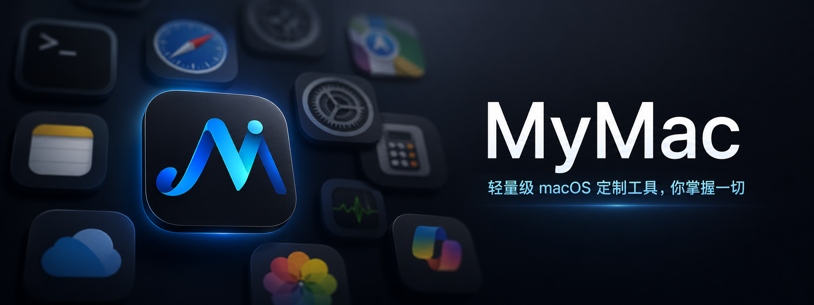

# MyMac



MyMac 是一个轻量的 macOS 菜单栏工具，支持 `Fn + H/J/K/L` 方向键映射与 `Fn + Space` 输入法切换，并保留常用修饰键组合。

## 特性

- 菜单栏常驻，默认无 Dock 图标
- `Fn + H/J/K/L` 映射为 `Left/Down/Up/Right`
- `Fn + Space` 切换英文输入源与系统记忆的非英文输入法
- 保留其他修饰键，便于组合操作
- 支持开机启动
- 首次启动引导与权限提示

## 系统要求

- macOS 14.0 或更高版本
- Xcode（支持 Swift 6）
- 需要开启 Accessibility 权限

## 快速开始

1. 用 Xcode 打开 `MyMac.xcodeproj`
2. 运行应用
3. 按提示在系统设置中授予 Accessibility 权限
4. 在菜单栏或设置页中分别启用方向键映射与输入法切换
5. 直接使用 `Fn + H/J/K/L` 或 `Fn + Space`

## 映射规则

| 输入 | 输出 |
| --- | --- |
| `Fn + H` | `Left` |
| `Fn + J` | `Down` |
| `Fn + K` | `Up` |
| `Fn + L` | `Right` |
| `Fn + Space` | 切换英文输入源与系统记忆的非英文输入法 |

输入法切换复用系统当前输入源状态，不需要额外权限；但快捷键监听仍依赖 Accessibility 权限。

## 本地构建

```bash
xcodebuild -project MyMac.xcodeproj -scheme MyMac -configuration Debug build
```

运行测试：

```bash
xcodebuild test -project MyMac.xcodeproj -scheme MyMac -destination 'platform=macOS'
```

## 说明

个人自用
